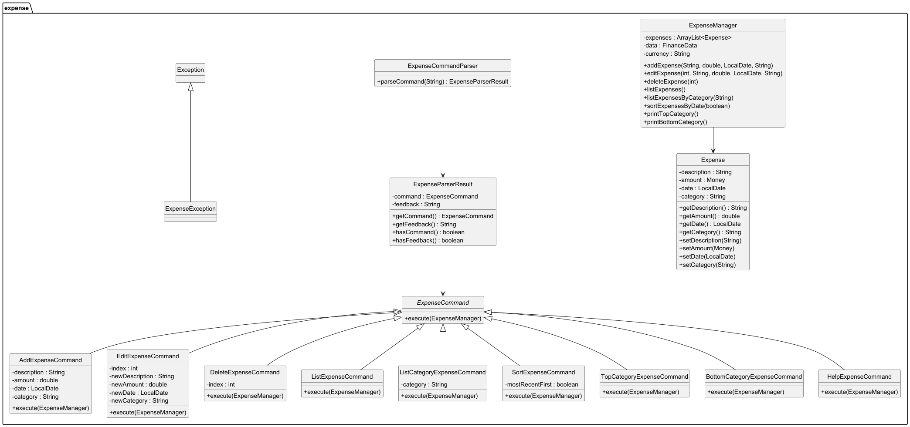
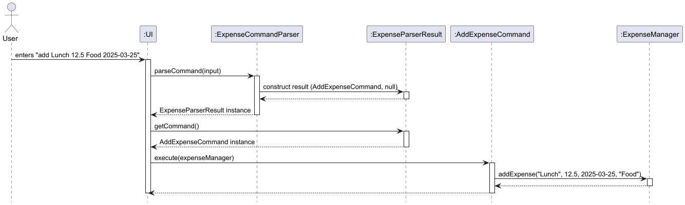
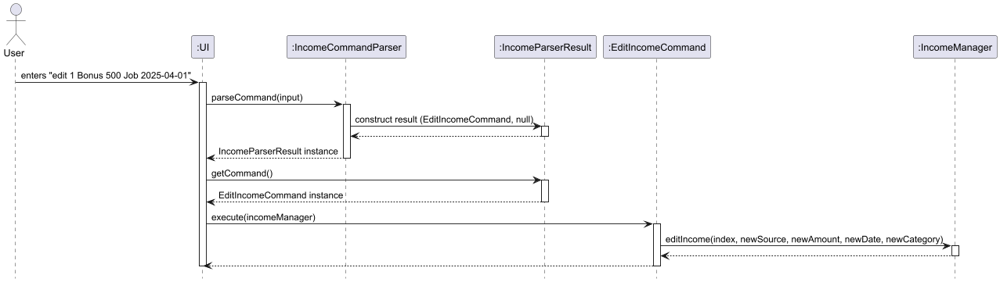

# Developer Guide

## Table of Contents

- [Design](#design)
   - [Expense Management](#expense-management)
   - [Income Management](#income-management)
   - [Budget Management](#budget-management)
   - [Saving Management](#saving-management)
   - [Loan Management](#loan-management)
- [Implementation](#implementation)
   - [Expense](#expense-)
   - [Income](#income)
   - [Saving](#saving-)
   - [Budget](#budget-)
   - [Loan](#loan)
- [Appendix A: Product Scope](#appendix-a-product-scope)
- [Appendix B: User Stories](#appendix-b-user-stories)
- [Appendix C: Non-Functional Requirements](#appendix-c-non-functional-requirements)
- [Appendix D: Glossary](#appendix-d-glossary)
- [Appendix E: Instructions for Manual Testing](#appendix-e-instructions-for-manual-testing)
- [Acknowledgements](#acknowledgements)

---

## Design

### Expense Management

The **Expense** modules is designed to provide full support for managing user expenses within the CashFlow application. It includes classes for command parsing, command execution, business logic, and error handling.

This module follows the **Command Pattern** for extensibility, the **Separation of Concerns** principle for maintainability, and includes robust user feedback mechanisms.

### Key Classes and Relationships

The diagram shows the how different classes within the expense package interacts with one another:



---

### Income Management

The **Income** module is responsible for managing user incomes within the CashFlow application. It mirrors the structure and principles of the Expense module, supporting features like adding, editing, deleting, listing, sorting, and category analysis for income entries.

This module follows the Command Pattern to organize operations, promotes Separation of Concerns, and ensures user-friendly parsing and error reporting.

---

### Key Classes and Relationships

The diagram below shows how different classes in the income package interact:


---

### Design Principles for both Expense and Income

- **Modularity**: Each command is encapsulated in its own class.
- **Single Responsibility**: Parsing, validation, and execution are delegated to separate classes.
- **Feedback-Oriented**: Parsers return structured results to inform users of errors without crashing the program.
- **Logging**: Uses `java.util.logging` to trace important events, hidden from the user interface.

---

### Budget Management

---

### Saving Management
   Responsible for implementing the Budget and Saving management modules. This includes the Budget, Saving, BudgetList, SavingList, and the associated commands and parsers.

The goal of these modules is to allow users to manage budgets and track savings efficiently, with support for adding, editing, deleting, listing, and viewing summary data.

#### Budget and Saving Logic
Each of the two entities — Budget and Saving — is represented by its own class and managed through its own container class (BudgetList, SavingList).

The diagram below shows the high-level class structure:


Budget: Represents a budget allocation for a specific month, storing variables as follows:
- name: String
- totalAmount: Money
- RemainingAmount: Money
- expenses: ArrayList<Expense>
- deadline: LocalDate
- category: String
- and BudgetCompletionStatus, BudgetExceedStatus

---

### Loan Management
This includes the `Loan`, `Interest`, `LoanManager` and associated commands and parsers.

The goal of these modules is to allow users accurately and efficiently manage their loanManager, as well as loanManager between other people. The module supports the adding, editing, deleting, listing, tagging, sorting and searching entries.

#### Loan Structure

Every type of loan inherits from the abstract `Loan` class, which contains universal attributes and methods for all loanManager. The loanManager are managed by the manager class `LoanManager`, which stores loanManager in an `ArrayList`.

#### Interest Structure

Advanced loan types that apply interests would each refer to an `Interest` class, which specifies how the interest is applied.

The diagram below shows the high-level class structure:


#### Command Parsing and Execution

To carry out operations on the loanManager, the user inputs are read through the `LoanUI` class and parsed by the `LoanCommandParser` class, which generates commands based on the user's inputs.

Each command extends from an abstract `LoanCommand` base class and overrides the `execute()` method.

Due to the large number of attributes in each `Loan` class, the parser would ask for inputs sequentially.

The diagram below shows the high-level class structure for loan commands:


--- 

### Other utilities

#### Money

#### Tags

---
## Implementation

### Expense 

Represents a single expense entry with attributes:
- `desc`: What the expense is.
- `amount`: A `Money` object representing the amount.
- `date`: When the expense was added.
- `category`: A tag to group the expense.

### ExpenseCommandParser

- Responsible for parsing and validating commands entered in **expense mode**.
- Produces `ExpenseParserResult` containing either a valid command or a user-friendly error message.
- Supports commands:
   - `add <description> <amount> <category> [yyyy-mm-dd]`
   - `edit <index> <newDesc> <newAmount> <newCategory> [yyyy-mm-dd]`
   - `delete <index>`
   - `list` / `list category <category>`
   - `sort recent` / `sort oldest`
   - `top` / `bottom`
   - `help`

### ExpenseParserResult

- Contains two fields:
   - `command`: an `ExpenseCommand` object (if parsed successfully).
   - `feedback`: a `String` containing an error message (if any issue occurs).

### ExpenseManager

- Stores the list of expenses and manages business logic.
- Methods include:
   - `addExpense(...)`: Validates and adds new expense.
   - `editExpense(...)`: Updates an existing expense by index.
   - `deleteExpense(...)`: Removes expense by index.
   - `listExpenses()` and `listExpensesByCategory(...)`: Lists all or filtered expenses.
   - `sortExpensesByDate(...)`: Sorts by date.
   - `printTopCategory()` / `printBottomCategory()`: Computes category statistics.

### ExpenseCommand and Subclasses

Each command like `AddExpenseCommand`, `EditExpenseCommand`, `DeleteExpenseCommand` extends `ExpenseCommand` and overrides `execute(ExpenseManager manager)`.

For example, `AddExpenseCommand`:
```java
public void execute(ExpenseManager manager) {
    manager.addExpense(description, amount, date, category);
}
```

This makes testing and future enhancements (e.g. undo/redo) straightforward.

An example of the sequence diagram for Add Expense Command is as shown:


---

### Income

Represents a single income entry with attributes:
- `source`: Where the income came from.
- `amount`: A `Money` object representing the amount.
- `date`: When the income was received.
- `category`: A tag to group the income.

### IncomeCommandParser

- Responsible for parsing commands entered in **income mode**.
- Returns an `IncomeParserResult` object containing a valid command or an error message.
- Supports commands:
   - `add <source> <amount> <category> [yyyy-mm-dd]`
   - `edit <index> <newSource> <newAmount> <newCategory> [yyyy-mm-dd]`
   - `delete <index>`
   - `list` / `list category <category>`
   - `sort recent` / `sort oldest`
   - `top` / `bottom`
   - `help`

### IncomeParserResult

- Acts as a structured container for parsing outcomes:
   - `command`: The valid `IncomeCommand` if parsing succeeds.
   - `feedback`: Error message string to show user if parsing fails.

### IncomeManager

- Maintains an `ArrayList<Income>` and implements business logic:
   - `addIncome(...)`: Adds new income after validation.
   - `editIncome(...)`: Updates an income entry by index.
   - `deleteIncome(...)`: Removes income at specified index.
   - `listIncomes()` / `listIncomesByCategory(...)`: Lists all or filtered incomes.
   - `sortIncomesByDate(...)`: Sorts by recent or oldest.
   - `printTopCategory()` / `printBottomCategory()`: Computes income statistics.

### IncomeCommand and Subclasses

Each specific income action is encapsulated in its own class, extending `IncomeCommand`. For example, `AddIncomeCommand`, `EditIncomeCommand`, `DeleteIncomeCommand` implement their own `execute(IncomeManager manager)` method.

Example from `EditIncomeCommand`:
```java
public void execute(IncomeManager manager) {
   manager.editIncome(index, newSource, newAmount, newDate, newCategory);
}
```

This makes the logic modular, testable, and easily extendable.

An example of the sequence diagram for Edit Income Command is as shown:

---
### Error Handling for Expense and Income

- Custom exceptions via `ExpenseException` and `IncomeException` to handle user input validation.
- Example validations:
   - Description must not be empty.
   - Amount must be positive.
   - Index must be within list bounds.
- Parser handles syntax and structure validation; Manager handles business rule validation.

### Logging for Expense and Income

- Internally uses Java’s `Logger` to log all state-changing operations.
- Warnings are logged but not shown to users unless necessary.

---

### Budget 

#### Budget Expense Integration

This integration between two major classes is to allow users to know the status of their budgets after adding their expenses.

It is done by calling a boolean method from `Expense Manager` to check if budget is exceeded or not. A warning will be displayed if budget has been exceeded.

```
BudgetManager budgetManager = data.getBudgetManager();
if (budgetManager != null) {
   boolean exceeded = budgetManager.deductBudgetFromExpense(expense);
   if (exceeded) {
       System.out.println("Warning: You have exceeded your budget for category: " + category);
   }
}
```


---

### Saving 
This is an example of the implementation of the Budget and Saving command: `Set Budget`,
which can represent the generic flow of the Budget and Saving management's execution flow.

1. The user inputs the set-budget command.

2. LogicManager (`BudgetGeneralCommand`) passes it to SetBudgetCommandParser.

3. A Budget object is created.

4. SetBudgetCommand is constructed with the budget.

5. Execute(`BudgetList`) adds the budget to the model.

6. The UI reflects the update by printing a success message and the attributes of the `Budget`.


#### General Logic For Budget and Saving in sequence diagram:


---

### Loan


---
## Appendix A: Product Scope

### Target user profile

- CLI users who prefer keyboard-based interactions.
- Budget-conscious individuals tracking daily spending.
- Students, young adults or working professionals managing personal finances.

### Value proposition

- Easy and fast, keyboard-based way of recording transactions.
- No setup or signup — works locally and offline.
- Lightweight and highly customizable.
- Centralizes expenses, incomes, budgets, savings, and loanManager.

## Appendix B: User Stories

| Priority | As a ... | I want to ... | So that I can ... |
|----------|-----------|----------------|-------------------|
| High | User | Add expenses | Track spending |
| High | User | Edit/delete expenses | Fix mistakes |
| Medium | User | Sort expenses | View spending trends |
| Medium | User | See top category | Analyze major expenses |
| High | User | Add income sources | Record earnings |
| Medium | User | Manage budgets | Stay within limits |
| Medium | User | Save for goals | Reach financial milestones |
| Low | User | Track loanManager | Manage borrowings and lending |

---

## Appendix C: Non-Functional Requirements

- Should work on Windows, MacOS, and Linux with Java 17+.
- Must handle 100+ records without performance drop.
- CLI should respond within 1 second per command.

---

## Appendix D: Glossary

- **CLI**: Command Line Interface
- **Index**: The number shown when listing items; used to refer to entries.
- **Expense**: Money spent.
- **Income**: Money received.
- **Budget**: Limit set on specific categories.
- **Loan**: Money lent or borrowed, optionally with interest.
- **Category**: A label such as "Food", "Job", "Transport".
---

## Appendix E: Instructions for Manual Testing

### Expense Module

1. Run `expense` to enter expense mode.
2. Try:
   ```
   add Lunch 10 Food 2025-04-01
   list
   edit 1 Dinner 20 Food
   delete 1
   sort recent
   ```

### Income Module

1. Run `income` mode.
2. Try:
   ```
   add Salary 3000 Job 2025-04-01
   edit 1 Bonus 500 Job
   list
   delete 1
   ```

### Budget Module

```
budget
set n/Trip a/1000 e/2025-12-31 c/Travel
check i/1
add i/1 a/500
deduct i/1 a/200
modify i/1 n/Holiday
```

### Saving Module

```
saving
set n/Laptop a/2000 b/2025-10-01
contribute i/1 a/500
list
```

### Loan Module

```
loan
add
list
show 1
edit 1 description
find John outgoing loan
delete 1
```

---

## Acknowledgements

- This project reused some ideas and interfaces from the [AddressBook-Level3](https://github.com/se-edu/addressbook-level3) project.
- Structure and format of the Developer Guide closely follow AB3’s conventions.

Note: Manual testing does not persist data unless storage is implemented. Re-adding entries is required after restarting the app.