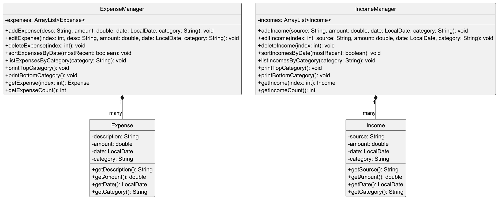
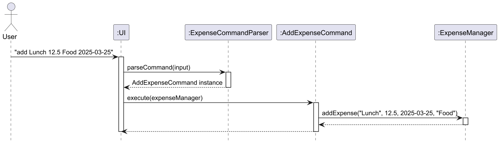

# Developer Guide

## Acknowledgements

- The command parsing design is inspired by the Command Pattern described in the SE-EDU AddressBook-Level3.
- Parts of the error-handling and assertion patterns were referenced from Oracle’s Java tutorials.
- Logger setup referenced from standard Java logging documentation.

## Design & implementation

### Expense and Income

This includes the `Expense`, `Income`, `ExpenseManager`, `IncomeManager`, as well as all associated commands and parsers.

The goal of these modules is to allow users to accurately and efficiently manage their expenses and income with support for adding, editing, deleting, listing, categorizing, and sorting entries.

#### Expense and Income Structure

Each of the two core entities — Expense and Income — is represented by its own class (`Expense`, `Income`) and managed through its own manager class (`ExpenseManager`, `IncomeManager`).
The below shows the high-level class diagram:



#### Command Parsing and Execution

Each command extends from an abstract `ExpenseCommand` or `IncomeCommand` base class and overrides the `execute(...)` method.

Example sequence diagram for the command `add Lunch 12.5 Food 2025-03-25`:



This design simplifies testing, separates concerns clearly, and is extensible to other commands (e.g., filtering by date range in the future).

#### Key Implementation Choices

- **Command Pattern:** Each command is encapsulated in its own class with a single `execute(...)` method. This makes it easier to test and extend in the future.
- **Category Normalization:** Category strings are capitalized by the parser to ensure consistent matching.
- **Robust Input Parsing:** The parser uses defensive programming to avoid crashing on invalid user input, providing feedback when inputs are incomplete or incorrect.

#### Alternatives Considered

- Instead of a separate command class for each operation, we considered a generic `Command` with a type string and arguments. However, this would reduce readability and make each command's logic more error-prone.
- We considered storing all entries in a shared superclass like `FinancialEntry`, but this was not implemented as Expenses and Incomes may diverge in fields and behavior later.

#### Future Enhancements

- Support for recurring entries.
- Advanced search and filtering (e.g., date ranges).
- UI display of graphs or trends.


### Budget and Saving
   Responsible for implementing the Budget and Saving management modules. This includes the Budget, Saving, BudgetList, SavingList, and the associated commands and parsers.

The goal of these modules is to allow users to manage budgets and track savings efficiently, with support for adding, editing, deleting, listing, and viewing summary data.

#### Budget and Saving Logic
Each of the two entities — Budget and Saving — is represented by its own class and managed through its own container class (BudgetList, SavingList).

The diagram below shows the high-level class structure:


Budget: Represents a budget allocation for a specific month, storing variables as follows:
- name: String
- totalAmount: Money
- RemainingAmount: Money
- expenses: ArrayList<Expense>
- deadline: LocalDate
- category: String
- and BudgetCompletionStatus, BudgetExceedStatus


#### Implementation:

This is an example of the implementation of the Budget and Saving command: `Set Budget`,
which can represent the generic flow of the Budget and Saving management's execution flow.

1. The user inputs the set-budget command.

2. LogicManager (`BudgetGeneralCommand`) passes it to SetBudgetCommandParser.

3. A Budget object is created.

4. SetBudgetCommand is constructed with the budget.

5. Execute(`BudgetList`) adds the budget to the model.

6. The UI reflects the update by printing a success message and the attributes of the `Budget`.


#### General Logic For Budget and Saving in seuqnce diagram:


### Loan

This includes the `Loan`, `Interest`, `LoanManager` and associated commands and parsers.

The goal of these modules is to allow users accurately and efficiently manage their loans, as well as loans between other people. The module supports the adding, editing, deleting, listing, categorizing, sorting and searching entries.

#### Loan Structure

Every type of loan inherits from the abstract `Loan` class, which contains universal attributes and methods for all loans. The loans are managed by the manager class `LoanManager`, which stores loans in an `ArrayList`.

#### Interest Structure

Advanced loan types that apply interests would each refer to an `Interest` class, which specifies how the interest is applied.

#### Command Parsing and Execution

To carry out operations on the loans, the user inputs are read through the `LoanUI` class and parsed by the `LoanCommandParser` class, which generates commands based on the user's inputs.

Each command extends from an abstract `LoanCommand` base class and overrides the `execute()` method.

Due to the large number of attributes in each `Loan` class, the parser would ask for inputs sequentially.

Example:


## Product scope
### Target user profile

- CLI users who prefer keyboard-based interactions.
- Budget-conscious individuals tracking daily spending.
- Students or working professionals managing personal finances.

### Value proposition

- Easy and fast recording of transactions.
- No setup or signup — works locally and offline.
- Lightweight and highly customizable.

## User Stories

| Priority | Version | As a ... | I want to ...                                                                              | So that I can ...|
|-------|---------|----------|--------------------------------------------------------------------------------------------|------------------|
| ***   | v1.0    |new user| see usage instructions                                                                     |refer to them when I forget how to use the application|
| ***   | v1.0    |user| find a to-do item by name                                                                  |locate a to-do without having to go through the entire list|
| ***   | v1.0    |university student with limited finances| set a budget                                                                               |avoid overspending|
| ***   | v1.0    |university student who wants to be secure financially| set savings goals (e.g., $500 for a trip)                                                  |motivate myself to save consistently|
| ***   | v1.0    |student with extra budget left| place part of my money into the saving goal                                                |reach my goal and see my progress|
| ***   | v1.0    |university student who often wonders about how much I saved| check regularly my saving goals                                                            |get a clearer understanding of my progress|
| **    | v2.0    |student who completed saving goals| get alert and achievement from the system for completion                                   |be motivated by my progress|
| ***   | v2.0    |student| restrict myself from overspending in a specific category and set a budget on that category |better monitor my expenses and plan my budget more efficiently|
| **    | v2.0    |student| receive alerts when I exceeded my budget                                                   |adjust my spending in time|
| ***   | v2.0    |user| see inline suggestions when typing commands                                                |navigate commands more easily|
| **    | v2.1    |student who completed saving goals| get a saving summary when I complete my goal                                               |know how long it took and my average saving per day|
| *     | v2.1    |student who is busy with my work| set recurring budget and saving goal                                                       |avoid manually adding them, which I might forget|


## Non-Functional Requirements

- Runs on any OS with Java 17+.
- Handles up to 1000 entries without noticeable lag.
- Should respond to commands within 1 second.
- CLI-based, with no need for internet connection.

## Glossary

| Term            | Definition                                                             |
|-----------------|------------------------------------------------------------------------|
| CLI             | Command-Line Interface                                                 |
| Command Pattern | A design pattern in which each action is encapsulated in its own class |
| Category        | A label like Food, Transport, Job, etc., used to group entries         |
| UI              | User Interface, where the user and a computer system interact          |  


### Testing


#### Key Implementation Choices
Domain Classes: Having separate Budget and Saving classes allows clearer separation of concerns and future flexibility.

Date Parsing: Uses YearMonth and LocalDate to ensure correct input validation and display formatting.

#### Alternatives Considered
Using a shared superclass like FinancialEntry to generalize Budget and Saving.

- Rejected to avoid premature generalization and preserve domain-specific logic.

Managing budget/saving lists directly inside ModelManager.

- Rejected in favor of separate BudgetList and SavingList classes to improve modularity and unit testing.

#### Future Enhancements
Support for recurring budgets (e.g., auto-renewing monthly budgets)

Budget vs actual visualization using bar/line graphs

Add filters for purpose, amount, and date/month

Export functionality (e.g., CSV or Excel)


## Instructions for manual testing

The following steps help a tester verify the correctness of features:

1. **Add an expense:**
   ```
   add Coffee 4.5 Drink 2025-04-01
   ```
    - Expected: "Added: Coffee - $4.5 on 2025-04-01 [Category: Drink]"
   

2. **List expenses:**
   ```
   list
   ```
    - Expected: Display list with the added expense.
   

3. **Edit an expense:**
   ```
   edit 1 Tea 3.0 Drink 2025-04-02
   ```
    - Expected: Entry should be updated to "Tea - $3.0 ..."
   

4. **Delete an expense:**
   ```
   delete 1
   ```
    - Expected: Entry is removed.
   

5. **Add income:**
   ```
   add Salary 2000 Job
   ```

6. **List incomes:**
   ```
   list
   ```

7. **Sort income by date:**
   ```
   sort recent
   ```

8. **Test top/bottom category analysis:**
   ```
   top
   bottom
   ```
   
### Budget

#### Going into the Budget Mode from the main menu: ```budget```

1. **Set a new Budget** 
 ```
   set n/NAME a/AMOUNT e/YYYY-MM-DD c/CATEGORY
 ```
- Follow the date format exactly or you will not be able to add the budget successfully
- Expected to see: Budget added, with the budget details being printed


2. **List Budget**
```
   list
```
- Expected to see all budgets, each with detailed attributes, except `ArrayList<Expenses>` and status

3. **Check Budget**
```
   check i/INDEX
```
- Expected to see the detailed information of the budget, including `ArrayList<Expenses>`

4. **Add to Budget**
```
   add i/INDEX, a/AMOUNT
```
- Expected to see both remaining amount and the total budget increases by AMOUNT

5. **Deduct from Budget**
```
  deduct i/INDEX a/AMOUNT
```
- Expected to see the remaining budget reduce by AMOUNT, while total budget unchanged

6. **Modify Budget**
```
   i/INDEX n/NAME a/AMOUNT e/YYYY-MM-DD c/CATEGORY
```
- You can exclude an of the attributes, but make sure not to add in the attribute identifier like
 `n/` if you are not modifying it
- Expected to see: any changes written in the command will be reflected in corresponding field in the Budget


### Saving

#### Going into the Saving Mode from the main menu: ```saving```


1. **Set a New Saving**
```
   n/GOAL_NAME a/AMOUNT b/YYYY-MM-DD
```
- Expected to see: the details of the saving printed with successful message

2. **List Savings** 
```
   list
```
- Expected to see: the details of all savings printed

3. **Contribute to a Saving**
```
   contribute i/INDEX a/AMOUNT
```
- Expected to see: the current amount saved increments by AMOUNT, while other attributes remain unchanged

Note: Manual testing does not persist data unless storage is implemented. Re-adding entries is required after restarting the app.